# 📘 Blog Frontend

A modern, responsive blog frontend application built with React, TypeScript, and Vite, designed to deliver a smooth and interactive user experience. This project acts as the client-side interface for a full-stack blog platform, allowing users to explore a wide range of blog posts, engage in meaningful discussions through nested comments, and connect with others via real-time chat powered by WebSocket and STOMP.

With an intuitive layout, infinite scrolling, media uploads, and multi-language support, this frontend ensures both usability and performance across devices. Users can register, log in, and manage their own posts with proper permission control. Integrated with a RESTful API backend, the app supports dynamic features such as fuzzy search, recently viewed post history, and live content updates. Whether you're a reader, contributor, or admin, this frontend is crafted to provide a seamless blogging experience with modern web technologies, scalable architecture, and maintainable codebase.

---

## 📑 Table of Contents

1. [📌 Features](#-features)  
2. [🛠️ Tech Stack](#️-tech-stack)  
3. [⚙️ Installation & Run](#️-installation--run)  
4. [🔗 Backend Integration](#-backend-integration)  
5. [📂 Folder Structure](#-folder-structure)  
6. [📸 Demo Screenshots](#-demo-screenshots)

---

## 📌 Features

- ✅ Real-time chat using WebSocket + STOMP (publish/subscribe)
- ✅ Infinite scroll for blog posts
- ✅ Image lazy loading
- ✅ Image & video upload in posts
- ✅ Nested comments (infinite expandable)
- ✅ Multi-language support (i18n)
- ✅ Post listing & detailed view
- ✅ User authentication (Login / Register)
- ✅ Create, edit, and delete posts (with permission)
- ✅ Responsive and user-friendly UI
- ✅ RESTful API integration
- ✅ Recently viewed post history (via Session Storage)
- ✅ Fuzzy search by post title

---

## 🛠️ Tech Stack

| Technology | Description |
|------------|-------------|
| [React](https://reactjs.org/) | UI library for building user interfaces |
| [TypeScript](https://www.typescriptlang.org/) | Typed superset of JavaScript |
| [Vite](https://vitejs.dev/) | Fast frontend build tool |
| [Tailwind CSS](https://tailwindcss.com/) | Utility-first CSS framework |
| [React Router DOM](https://reactrouter.com/) | Routing for SPA |
| [Axios](https://axios-http.com/) | HTTP client for API communication |
| [React Query](https://tanstack.com/query/latest) | Data fetching & caching |
| [Redux](https://redux.js.org/) | Global state management |
| [i18next](https://www.i18next.com/) | Internationalization framework |
| [WebSocket + STOMP](https://stomp-js.github.io/) | Real-time messaging protocol |
| ESLint + Prettier | Code linting & formatting |

---

## ⚙️ Installation & Run

### 1. Clone the repository

```bash
git clone https://github.com/ducminh1804/blog_frontend.git
cd blog_frontend
```

<p align="center">
    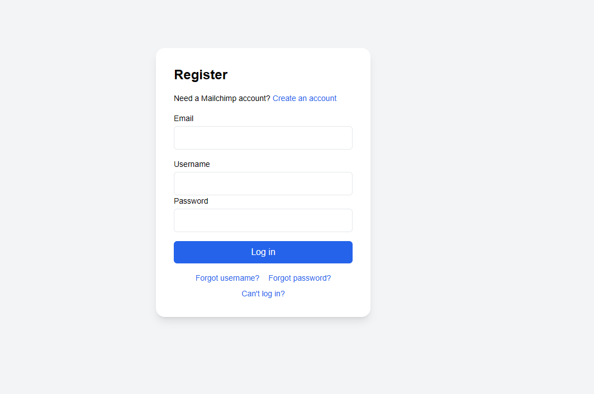
  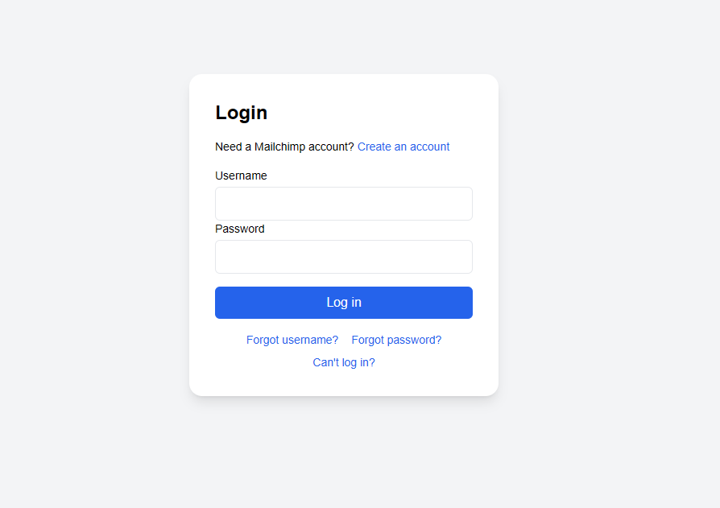
  <br>
  <em>Trang đăng kí, đăng nhập</em>
    <br></br>
</p>

<p align="center">
    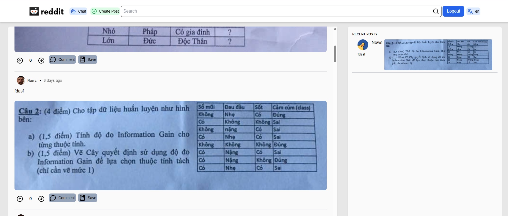
  <br>
  <em>Giao diện chính</em>
    <br></br>
</p>
<p align="center">
    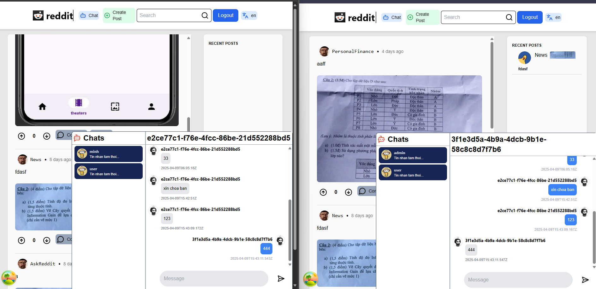
  <br>
  <em>Giao diện nhắn tin</em>
    <br></br>
</p>

<p align="center">
    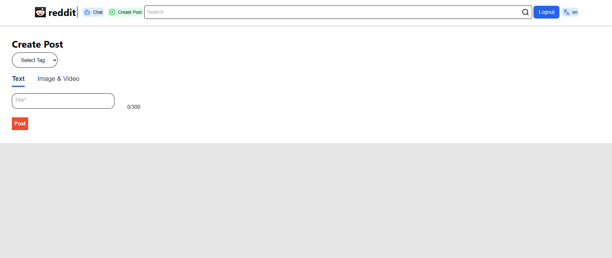
    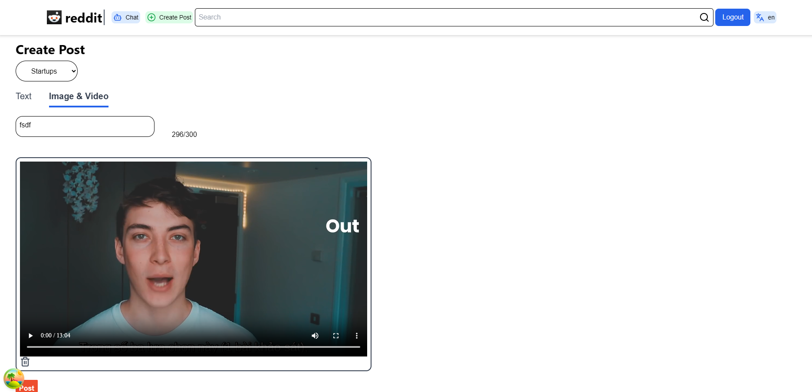
  <br>
  <em>Đăng tải bài viết, hình ảnh hoặc video</em>
    <br></br>
</p>

<p align="center">
    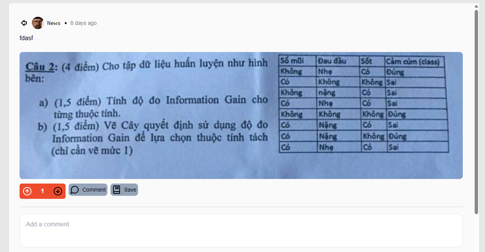
  <br>
  <em>Chi tiết bài viết</em>
    <br></br>
</p>
<p align="center">
    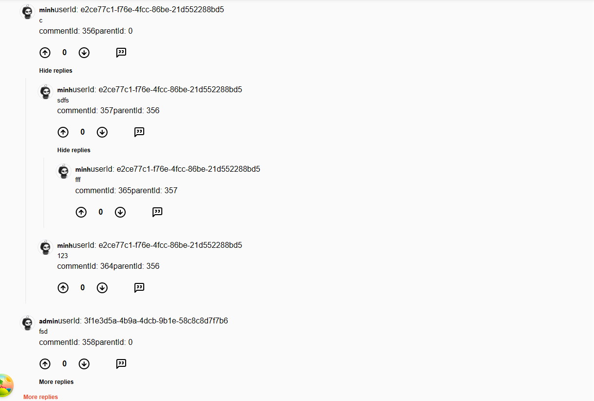
  <br>
  <em>Bình luận lồng nhau</em>
    <br></br>
</p>


<p align="center">
    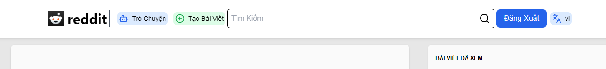
    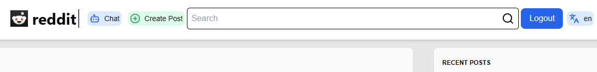
  <br>
  <em>Chuyển đổi ngôn ngữ</em>
    <br></br>
</p>

<p align="center">
    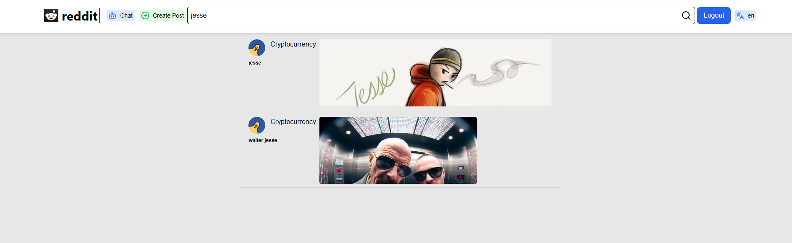
  <br>
  <em>Tìm kiếm bài viết với tiêu đề gần đúng</em>
    <br></br>
</p>
